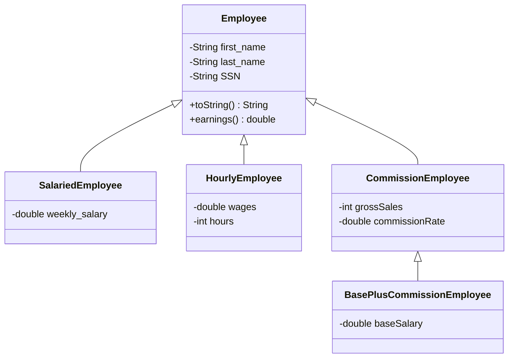

# Lab 01: Employee Hierarchy (Inheritance and Polymorphism in Java)

A weekly payroll application in Java that calculates pay for four types of employees **polymorphically**: one `Employee` array, one loop, and the right `earnings()` method runs for each object at runtime.

## 🎯 Task

A company pays its employees weekly. The pay rules differ by employee type:

| Class | Pay rule |
|-------|----------|
| `Employee` | Base class. `earnings()` prints a test message and returns `0.0` |
| `SalariedEmployee` | Fixed weekly salary |
| `HourlyEmployee` | `wages × hours` up to 40 hours, then `40 × wages + (hours − 40) × wages × 1.5` |
| `CommissionEmployee` | `commissionRate × grossSales` |
| `BasePlusCommissionEmployee` | `(commissionRate × grossSales) + baseSalary` |

The `Driver` class stores two objects of each type in one `Employee[10]` array and loops over it. During the loop, each `BasePlusCommissionEmployee` gets a **10% base salary increase**. This requires checking the object's real type at runtime. Finally, the program prints the runtime type of every object.

## 🧱 Class hierarchy



## 📁 Files

| File | Purpose |
|------|---------|
| `Employee.java` | Superclass: private name and SSN, getters/setters, `toString()`, `earnings()` |
| `SalariedEmployee.java` | Adds `weekly_salary`, overrides `earnings()` and `toString()` |
| `HourlyEmployee.java` | Adds `wages` and `hours`, applies 1.5× overtime after 40 hours |
| `CommissionEmployee.java` | Adds `grossSales` and `commissionRate` |
| `BasePlusCommissionEmployee.java` | Extends `CommissionEmployee` with a `baseSalary` |
| `Driver.java` | Creates the 10 employees and processes them polymorphically |

## ▶️ How to run

Requires JDK 17 or later.

```bash
cd labs/lab-01-employee-hierarchy
javac *.java
java Driver
```

## 🖥️ Sample output

```text
Employees processed polymorphically:

Base Employee: Ali Khan 111-11-1111
Employee's Earning
Earnings: $0.00

Salaried Employee: John Smith 333-33-3333 800.0
Earnings: $800.00

Hourly Employee: Zainab Ali 666-66-6666 20.0 50
Earnings: $1100.00

CommissionEmployee Employee: Fatima Noor 888-88-8888 0.1 20000
Earnings: $2000.00

BasePlusCommissionEmployee Employee: Hassan Raza 999-99-9999 0.04 5000 300.0
New base salary with 10% increase is: $330.00
Earnings: $530.00

--- Types of Objects ---
Employee 0 is a Employee
Employee 2 is a SalariedEmployee
Employee 4 is a HourlyEmployee
Employee 6 is a CommissionEmployee
Employee 8 is a BasePlusCommissionEmployee
```

The full run prints all 10 employees. This is a shortened version showing one of each type.

## 💡 Key concepts

**Polymorphism.** The array type is `Employee[]`, but each slot holds a subclass object. The line `currentEmployee.earnings()` runs the subclass version, chosen at runtime (dynamic dispatch). The loop never needs to know which type it has.

**Overriding.** Every subclass overrides `earnings()` and `toString()`, so the same method call gives type-specific results.

**`super()` constructor chaining.** Each subclass constructor calls `super(...)` to set the first name, last name and SSN, then initialises its own fields.

**Runtime type check with `instanceof`.** Only `BasePlusCommissionEmployee` has `setBaseSalary()`. Inside the loop, `instanceof` confirms the type, then a cast to `BasePlusCommissionEmployee` allows the 10% increase.

```java
if (currentEmployee instanceof BasePlusCommissionEmployee) {
    BasePlusCommissionEmployee employee = (BasePlusCommissionEmployee) currentEmployee;
    employee.setBaseSalary(employee.getBaseSalary() * 1.10);
}
```

**Encapsulation.** All fields are `private` and reached through public getters and setters.

## 📝 What I learned

- A superclass reference can hold any subclass object, but only the superclass's methods are visible without a cast.
- The overridden method that runs depends on the object's real type, not the reference type.
- `instanceof` plus a cast is the way to reach subclass-only methods safely.
- A subclass constructor must call `super(...)` to initialise inherited private fields.

## 🔗 Related

- Part of the [Java Web Technologies](../../README.md) coursework repo.
- Topic: Part 1, OOP (inheritance and polymorphism).
