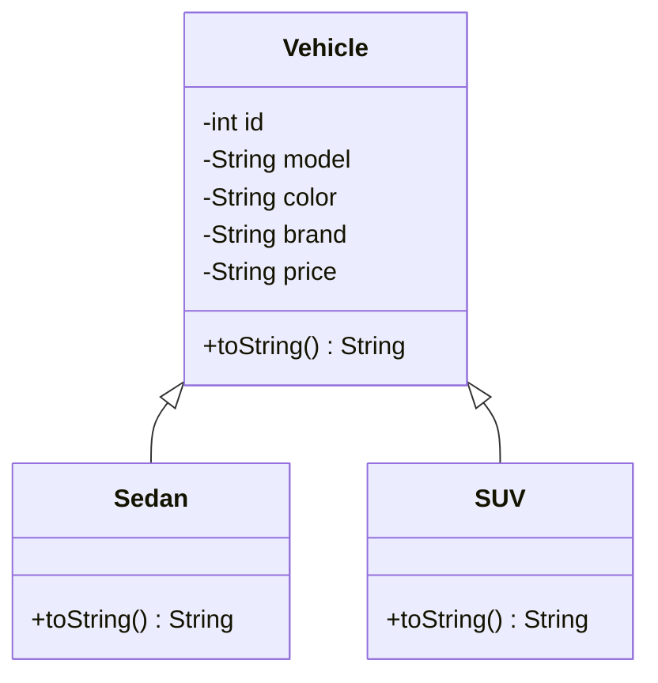

# Lab 02: Car Showroom (Packages and Inheritance in Java)

A console menu application for a car showroom, built across two Java packages: `showroom` for the vehicle classes and `runner` for the driver. The user picks from a menu to see all vehicles, only sedans or only SUVs.

> **Note:** this folder is still named `Lab_02`. It will be renamed to `lab-02-car-showroom` to match the naming used by [Lab 01](../lab-01-employee-hierarchy/).

## 🎯 Task

Build a small car showroom application with a `Vehicle` superclass and two subclasses, `Sedan` and `SUV`, each with `id`, `model`, `color`, `brand` and `price`. The `Driver` class holds an array of `Vehicle` and shows a menu:

1. Show all vehicles
2. Show only sedans
3. Show only SUVs
0. Exit

The type check uses `instanceof`, and each class overrides `toString()` to print its own description.

## 🧱 Class hierarchy



## 📦 Packages

| Package | Contains | Purpose |
|---------|----------|---------|
| `showroom` | `Vehicle.java`, `Sedan.java`, `SUV.java` | The vehicle data model |
| `runner` | `Driver.java` | The menu-driven entry point, imports `showroom.*` |

## 📁 Files

| File | Purpose |
|------|---------|
| `showroom/Vehicle.java` | Superclass: private id, model, color, brand, price with getters/setters and `toString()` |
| `showroom/Sedan.java` | Extends `Vehicle`, overrides `toString()` to prefix `"Sedan ==> "` |
| `showroom/SUV.java` | Extends `Vehicle`, overrides `toString()` to prefix `"SUV ==> "` |
| `runner/Driver.java` | Builds a `Vehicle[6]` (3 sedans, 3 SUVs) and runs the menu loop |

## ▶️ How to run

Requires JDK 17 or later. Compile both packages together so `runner` can resolve `showroom.*`.

```bash
cd labs/Lab_02
javac showroom/*.java runner/*.java
java runner.Driver
```

## 🖥️ Sample output

```text
--- Car Showroom Menu ---
1. Show All Vehicles
2. Show Only Sedan
3. Show Only SUV
0. Exit
Enter choice: 2

--- Sedan Information ---
Sedan ==> ID: 1
Model: Corolla X
Color: White
Brand: Toyota
Price: 65 Lakh
Sedan ==> ID: 2
Model: City Aspire
Color: Black
Brand: Honda
Price: 58 Lakh
Sedan ==> ID: 3
Model: Alsvin
Color: Blue
Brand: Changan
Price: 48 Lakh

--- Car Showroom Menu ---
1. Show All Vehicles
2. Show Only Sedan
3. Show Only SUV
0. Exit
Enter choice: 0
Thank you for visiting!
```

## 💡 Key concepts

**Packages.** `showroom` groups the data model, `runner` holds the entry point. `Driver` reaches the model classes with `import showroom.*;`, which mirrors how a real Java EE app separates model code from the class that drives it.

**Inheritance and `super()`.** Both `Sedan` and `SUV` pass every field straight to `Vehicle`'s constructor with `super(id, model, color, brand, price)` and add no fields of their own; only the `toString()` behaviour differs.

**Overriding with `super.toString()`.** Instead of repeating every field, each subclass reuses the parent's formatting and just adds a label:

```java
@Override
public String toString() {
    return "Sedan ==> " + super.toString();
}
```

**Runtime type check with `instanceof`.** The menu filters a single `Vehicle[]` array by asking each element its real type:

```java
if (v instanceof Sedan) {
    System.out.println(v.toString());
}
```

**Menu-driven I/O.** `Scanner` reads the user's choice, and a `do...while` loop keeps the menu showing until the user enters `0`.

## 📝 What I learned

- Splitting a program into packages (`showroom`, `runner`) keeps the data model separate from the part that runs the program.
- `super.toString()` lets a subclass extend a parent's formatting instead of duplicating it.
- `instanceof` is the right tool when a menu needs to filter a mixed-type array into one subtype at a time.

## 🔗 Related

- Part of the [Java Web Technologies](../../README.md) coursework repo.
- Builds on [Lab 01: Employee Hierarchy](../lab-01-employee-hierarchy/) (inheritance and polymorphism).
- Topic: Part 1, Packages.
